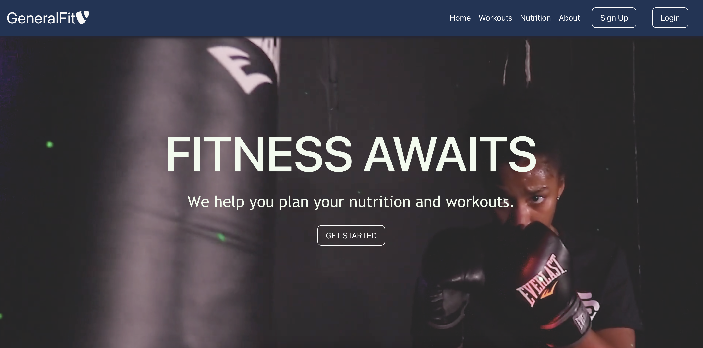
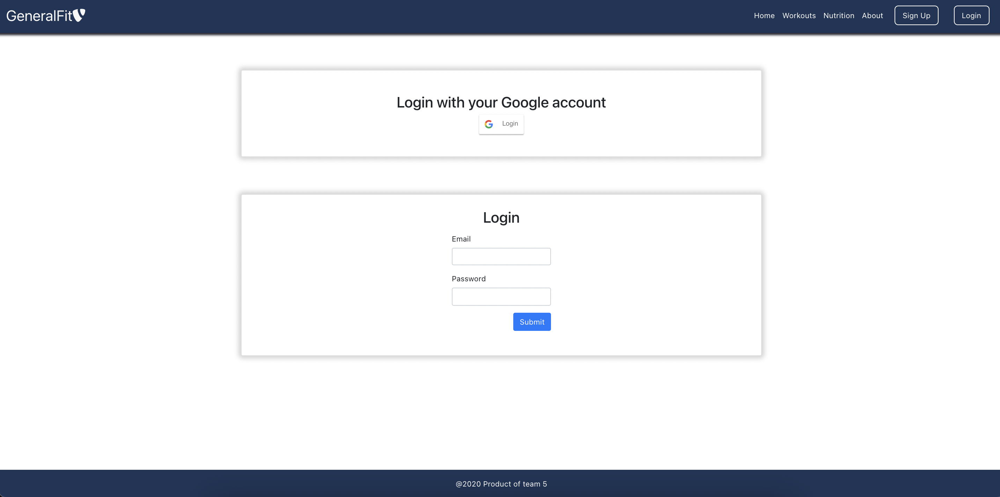
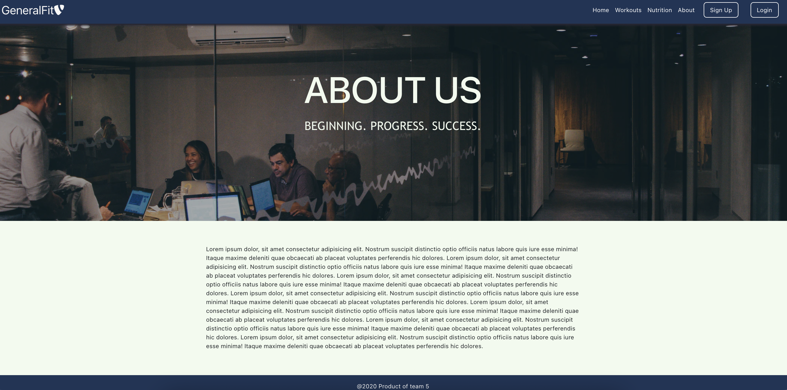
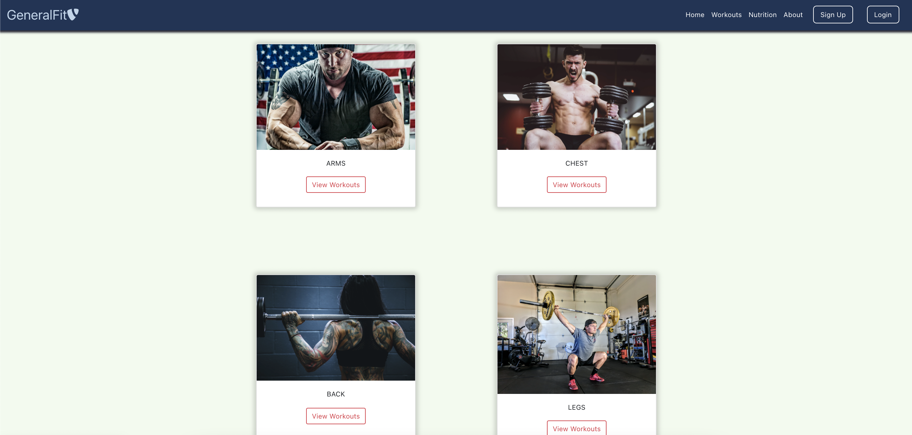
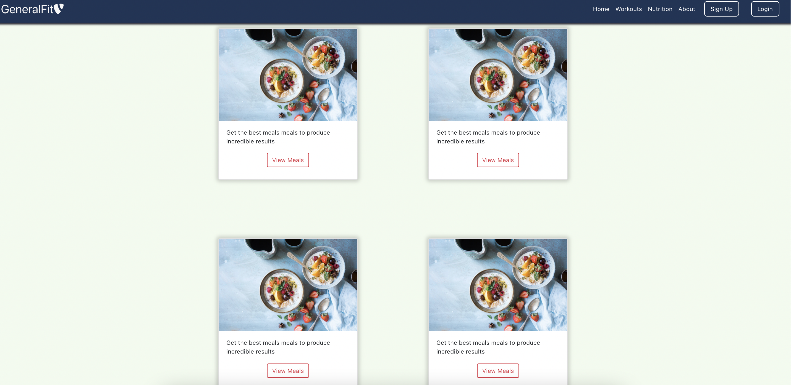

# GeneralFit
GeneralFit is a react app built to teach users about fitness and nutrition.
We believe fitness should be accessible to everyone, everywhere, regardless of income or access to a gym. With this app, users can learn about everything they need to have a heathly lifestyle.



----------------------------------------------------------
### Deployed on Heroku
[Heroku Live Link](https://generalfit.herokuapp.com/)

----------------------------------------------------------
## Local Deployment
----------------------------------------------------------  
### Github Repostitories
[Frontend](https://github.com/codebypaul/fitness_app_client)<br/>
[Backend](https://github.com/codebypaul/fitness_app_backend)

### Prerequisites
* Git
* Node
* MongoDB
* Fork of Repositories

### Installation
1. `cd` into repositories
2. `npm install` node packages

### Running Locally
1. `npm start` to start servers
2. `open http://localhost:3000` to open the app in your browser
----------------------------------------------------------
## Overview
----------------------------------------------------------
### Technologies
* MERN Stack (MongoDB, Express, React, Node)
* HTML5
* CSS
* Javascript
----------------------------------------------------------
### User Stories
As a user, I want to see basic information on the home page. As a user, I want to find workouts sorted by body parts. As a user, I want to find meals. As a user, I want to create fitness plans using the workouts and meals.

----------------------------------------------------------
### Features
Users can login with Google OAuth to share specific data with an application while keeping their usernames, passwords, and other information private.


----------------------------------------------------------
### Models and Schemas
#### Workout
```js
const workoutSchema = new mongoose.Schema({
    name:String,
    picture: String,
    category: String,
    sets: Number,
    reps: Number,
    description: String
})
```
#### Food
```js
const foodSchema = new mongoose.Schema({
    name: String,
    ingredients: [String],
    instructions : [String],
    nutritionData: [String],
    category: String,
    image : String
})
```
#### User
```js
const UserSchema = new mongoose.Schema({
    googleId: {
        type: String,
        required: false
    },
    displayName: {
        type: String,
        required: false
    },
    firstName: {
        type: String,
        required: true
    },
    lastName: {
        type: String,
        required: true
    },
    email: {
        type: String,
    },
    password: {
        type: String
    },
    DOB: {
        type: String
    },
    image: {
        type: String,
    },
    admin: {
        type: Boolean,
        default: false
    },
    createdAt: {
        type: Date,
        default: Date.now()
    },

})
```
----------------------------------------------------------
### ERD

----------------------------------------------------------
### Wireframes
Signup

Login

About

Workouts

Nutrition


----------------------------------------------------------
### Routes
| Method | Path | Location | Purpose |
| ------ | ---------------- | -------------- | ------------------- |
| GET | / | Welcome.js | Home Page |
| GET | /signup | Signup.js | Signup Page |
| GET | /login | Login.js | Login Page |
| GET | /about | About.js | About Page |
| GET | /profile | Profile.js | User Profile |
| GET | /workouts | Workouts.js | Workouts Page |
| GET | /nutrition | Nutrition.js | Nutrition Page |
| GET | /api/users/test | users.js | Users API |
| POST | /api/users/register | users.js | Users API |
| POST | /api/users/login | users.js | Users API |
| GET | /api/users/current | users.js | Users API |
| GET | /api/foods/test | food.js | Food API |
| GET | /api/foods | food.js | Food API |
| GET | /api/foods/:name | food.js | Food API |
| GET | /api/foods/category:category | food.js | Food API |
| POST | /api/foods | food.js | Food API |
| PUT | /api/foods | food.js | Food API |
| DELETE | /api/foods/delete/:name | food.js | Food API |
| GET | /api/foods | food.js | Food API |
| GET | /api/workouts | workout.js | Workout API |
| GET | /api/workouts/workout:id | workout.js | Workout API |
| GET | /api/workouts/category/:name | workout.js | Workout API |
| POST | /api/workouts | workout.js | Workout API |
| DELETE | /api/workouts/:id | workout.js | Workout API |

----------------------------------------------------------
### Unsolved Problems and Major Hurdles


----------------------------------------------------------
### Team Members
- Angel Barranco
- Felix Muwanguzi
- Paul Williams
- Richard Leung
